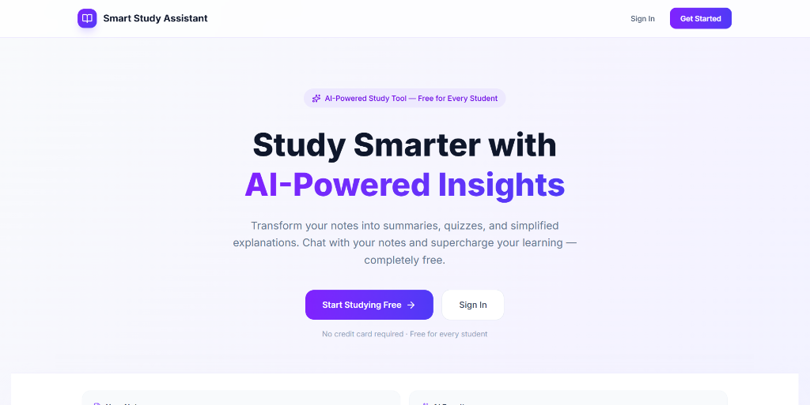
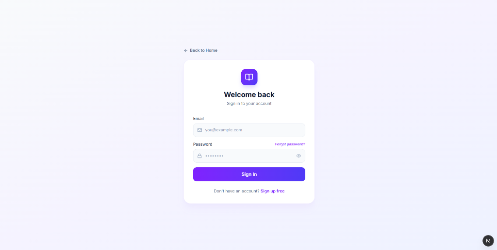
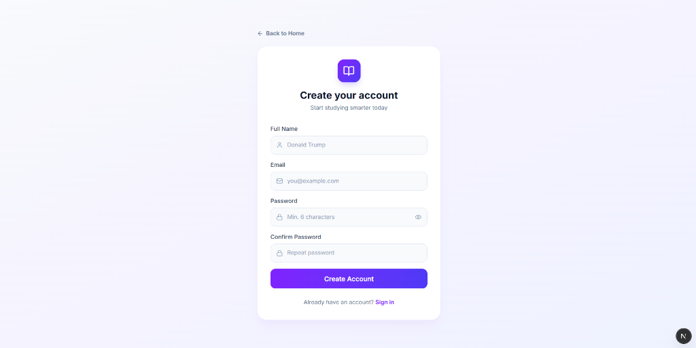
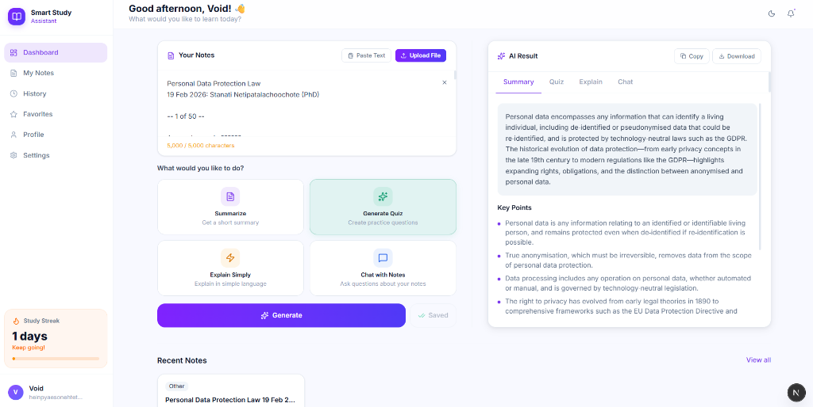
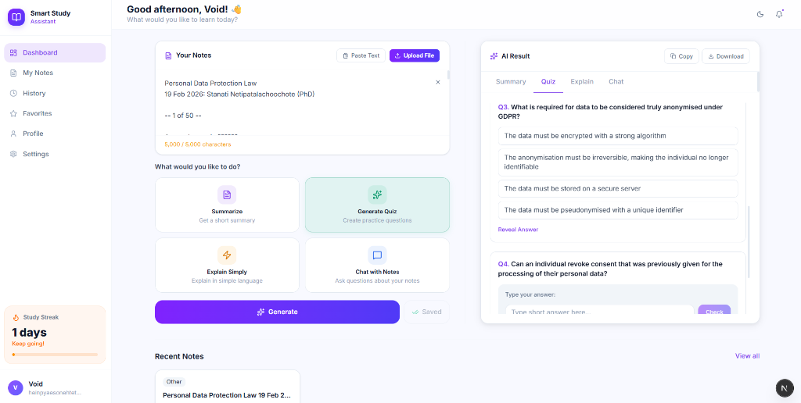

# 🎓 Smart Study Assistant

🚀 **Live Site**: [smart-study-assistant-taupe.vercel.app](https://smart-study-assistant-taupe.vercel.app/)

<div align="center">
  <p align="center">
    <a href="https://smart-study-assistant-taupe.vercel.app/">
      
    </a>
  </p>

  [](https://nextjs.org/)
  [](https://supabase.com/)
  [](LICENSE)
</div>

---

### 💡 Transform Your Study Notes into Superpowered Learning Tools

**Smart Study Assistant** is a modern, AI-powered study companion designed to optimize your learning workflow. Instead of studying harder, study smarter by instantly turning your notes, PDFs, or documents into structured study plans, quizzes, and customized explanations.

---

## 🔐 Secure Authentication

Simple, clean, and secure signup and login pages powered by **Supabase Auth**, featuring live form validation and password visibility toggles:

<div align="center">
  <table>
    <tr>
      <td width="50%" align="center"><b>🔑 Sign In</b></td>
      <td width="50%" align="center"><b>📝 Sign Up</b></td>
    </tr>
    <tr>
      <td></td>
      <td></td>
    </tr>
  </table>
</div>

---

## 🖥️ Interactive Dashboard in Action

The workspace is designed for maximum study efficiency, featuring auto-saves, dynamic generation panels, and a contextual study chat.

### 📝 AI Summaries & Study Notes
Paste text or upload files (PDFs, TXT, DOCX) to instantly generate structured summaries, key bullet points, and simplified explanations.

<div align="center">
  <p align="center">
    
  </p>
</div>

### ❓ Interactive Practice Quizzes
Test your knowledge by generating custom multiple-choice and short-answer quizzes from your materials, featuring real-time grading and feedback.

<div align="center">
  <p align="center">
    
  </p>
</div>

---

## ✨ Features at a Glance

| Feature | Description |
| :--- | :--- |
| **📝 Smart Summaries** | Condense extensive notes or documents into structured markdown summaries and key bullet points. |
| **❓ Interactive Quizzes** | Generate dynamic Multiple Choice / Short Answer practice questions with real-time feedback and validation. |
| **💡 Feynman Explainer** | Simplify complex terms, physics equations, or academic concepts using clear, intuitive analogies. |
| **💬 Contextual Sidebar Chat** | Chat directly with your notes to query, clarify, or expand on any topic within your study material. |
| **🏷️ Auto-Tagging** | Automatically categorize your files into academic subjects (*Biology, Physics, Chemistry, Math, History, CS, etc.*). |
| **📁 Document Parser** | Extract text from PDF, TXT, DOC, and DOCX documents with robust binary stream parsing. |
| **🛡️ Hardened Security** | Keep your data private with Supabase Row-Level Security (RLS) and secure password-verified account deletion. |

---

<details>
<summary><b>🛠️ Technology Stack & Architecture</b></summary>

* **Frontend**: Next.js 15 (App Router, React 19), Tailwind CSS
* **Database & Authentication**: Supabase (PostgreSQL, GoTrue, Row Level Security)
* **AI Cognitive Processing**: OpenRouter API (utilizing free-tier LLM models)
* **File Processing**: `pdf-parse`

</details>

<details>
<summary><b>🚀 Local Development Setup</b></summary>

### 1. Prerequisites
Ensure you have [Node.js](https://nodejs.org/) installed (v18.x or higher is recommended).

### 2. Configuration (`.env.local`)
Create a `.env.local` file in the root of the project with the following configuration:
```env
# Supabase Configuration
NEXT_PUBLIC_SUPABASE_URL=your-supabase-url
NEXT_PUBLIC_SUPABASE_ANON_KEY=your-supabase-anon-key
SUPABASE_SERVICE_ROLE_KEY=your-supabase-service-role-key

# AI Provider Configuration
OPENROUTER_API_KEY=your-openrouter-free-api-key
```

### 3. Database Schema Setup
Execute the SQL scripts inside `supabase/schema.sql` within your Supabase project's SQL editor to set up the necessary tables, policies, triggers, and RPC functions.

### 4. Install Dependencies
```bash
npm install
```

### 5. Run the Local Server
```bash
npm run dev
```
Open [http://localhost:3000](http://localhost:3000) in your browser to view the application.

</details>

<details>
<summary><b>📦 Production Build & Deployment</b></summary>

### Production Builds
To compile and optimize the application for production deployment, run:
```bash
npm run build
```
To preview the built production site locally, run:
```bash
npm run start
```

### Deployment
The application is fully compatible with **Vercel** out of the box:
1. Push the code repository to GitHub, GitLab, or Bitbucket.
2. Go to the [Vercel Dashboard](https://vercel.com/) and click **Add New Project**.
3. Import the repository.
4. Input the environment variables (from `.env.local`) in Vercel's **Environment Variables** configuration.
5. Click **Deploy**. Vercel will bundle the codebase and host it on HTTPS.

</details>

---

## 📄 License

This project is open-source and available under the [MIT License](LICENSE).
